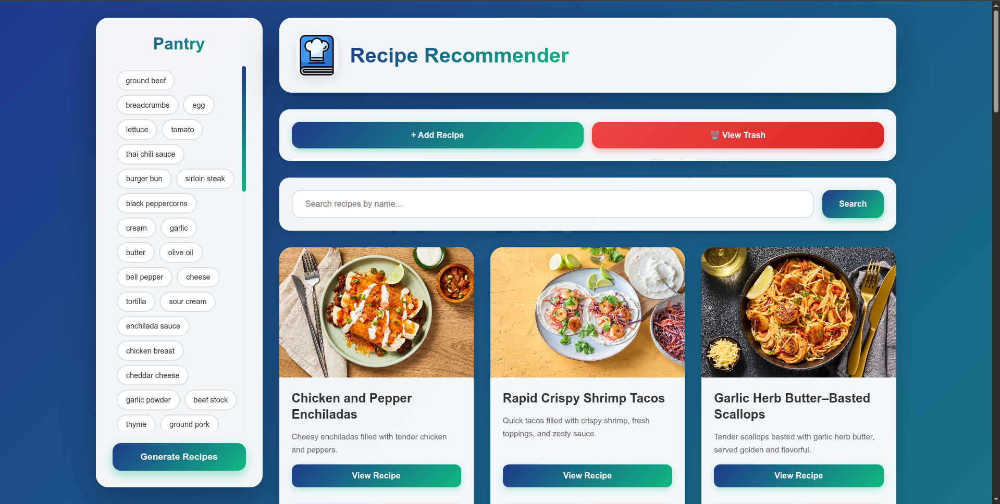

# Recipe Recommendation System


[](https://opensource.org/licenses/MIT)
[](https://nodejs.org/)
[](https://www.mongodb.com/)


A React app with Node.js and MongoDB backend that suggests recipes based on the ingredients you have. Users can also search recipes by name and view detailed recipe instructions.


---

## Features

- Select ingredients from your pantry to find matching recipes.
- Search recipes by name.
- View matched ingredients count for each recipe.
- Open recipes directly via source link.

---

## Tech Stack

- **Frontend:** React, CSS
- **Backend:** Node.js, Express
- **Database:** MongoDB

---

## Prerequisites

Make sure you have the following installed:

- [Node.js](https://nodejs.org/)
- [MongoDB](https://www.mongodb.com/)

---

## Installation

Clone the repository:

```bash
git clone <your-repo-url>
cd Recipe_Recommendation
```

---

## Backend Setup

```bash
cd backend
npm install
```

Import recipes into MongoDB:

```bash
npm run import-db
```

Start the backend server:

```bash
npm start
```

## Frontend Setup

```bash
cd frontend
npm install
npm start
```

The frontend will be available at http://localhost:3000 and will communicate with the backend at http://localhost:5000.

---
## Project Structure

```bash
Recipe_Recommendation/
│
├─ backend/            # Node.js + Express API
│  ├─ recipes.json      # Sample recipe data
│  └─ index.js          # Server entry point
│
├─ frontend/           # React app
│  └─ src/              # React components and CSS
│
└─ README.md
```

## Usage

Open the frontend in your browser.

Select ingredients from the sidebar.

Click Generate Recipes.

Optionally, search for recipes by name.

Click View Recipe to open the source.

## License

This project is open-source. Feel free to use and modify it.

---
